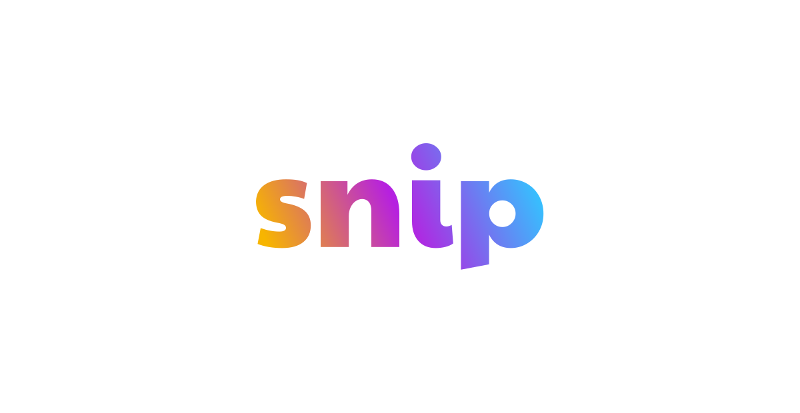

<p align="center">
  <a href="https://sniptt.com">
    
  </a>
</p>

<p align="right">
  <i>If you use this repo, star it ✨</i>
</p>

***

<p align="center">🔐 <b>A simple developer-friendly CLI for managing secrets</b></p>

***

**Looking to share end-to-end encrypted secrets via a one-time URL?**

⚡️ Check out **[ots](https://github.com/sniptt-official/snip)** - our zero-configuration, light-weight CLI written in Go and designed specifically for fast and secure sharing of one-time secrets.

***

<p align="center">
  <b>Please note that this project is under active development. APIs might change before version 1 is released.</b>
</p>

## Table of Contents

*   [Introduction](#introduction)
*   [Install](#install)
    *   [Homebrew](#homebrew)
        *   [Update](#update)
    *   [npm](#npm)
    *   [Manual](#manual)
*   [Features](#features)
*   [Basic Usage](#basic-usage)
    *   [Setup](#setup)
    *   [Add secrets](#add-secrets)
    *   [Read secrets](#read-secrets)
    *   [Vaults](#vaults)
    *   [Update secrets](#update-secrets)
    *   [Sharing](#sharing)
*   [Useful reading](#useful-reading)
*   [FAQ](#faq)
    *   [Why should I trust you with my secrets?](#why-should-i-trust-you-with-my-secrets)
    *   [What data do you store on your backend?](#what-data-do-you-store-on-your-backend)
    *   [How are vault secrets protected?](#how-are-vault-secrets-protected)
    *   [Is one-time secret sharing really secure?](#is-one-time-secret-sharing-really-secure)
    *   [What happens if I lose access to my key/laptop?](#what-happens-if-i-lose-access-to-my-keylaptop)
    *   [Is Snippt free?](#is-snippt-free)
    *   [Will there be a self-hosted option available in future?](#will-there-be-a-self-hosted-option-available-in-future)
    *   [Why does it sometimes take longer to fulfill a request?](#why-does-it-sometimes-take-longer-to-fulfill-a-request)
*   [License](#license)

## Introduction

**Sniptt is a developer-friendly secret manager.**

It simplifies and improves the experience of sharing end-to-end encrypted secrets such as API keys, database passwords, and other credentials between engineers.

You can finally say goodbye to 1Password, LastPass, and Dashlane 👋.

Read more in our introductory post on [Sharing secrets with teams](https://sniptt.medium.com/sharing-secrets-with-teams-82fde5b11149).


## Install

### Homebrew

The recommended way to install `snip` on macOS is via Homebrew.

```sh
brew tap sniptt-official/tap
brew install snip
```

#### Update

To update to latest version of `snip`, use:

```sh
brew upgrade snip
```

If you're using macOS Keychain to store the master passphrase, you might need to grant `snip` access to the **Sniptt Safe Storage** item by clicking "Always Allow".

### npm

Alternatively, you can also install `snip` via npm.

```sh
npm install sniptt -g
```

### Manual

See [Releases](https://github.com/sniptt-official/snip/releases)

## Features

*   **🔐 End-to-end encryption:** Secrets are encrypted using [OpenPGP](https://www.openpgp.org/), the most widely used messaging encryption standard.
*   **👾 For developers, by developers:** Protect and share secrets directly from your terminal.
*   **🔗 Immutable and cryptographically verifiable (coming soon):** Stay comforted knowing that every secret has a complete and verifiable history of changes over time. Powered by [Amazon QLDB](https://aws.amazon.com/qldb/).

## Basic Usage

### Setup

Create a new account or configure a new device with an existing account.

```sh
$ snip configure
```

For advanced usage, type `$ snip configure -h`.

### Add secrets

Add end-to-end encrypted secrets to your personal vault.

```sh
# Add simple key/value (you will be prompted using hidden password input).
$ snip add DB_PASSWORD

# Add file.
$ snip add --file .env.prod
```

For advanced usage, type `$ snip add -h`.

### Read secrets

Read end-to-end encrypted secrets from your personal vault.

```sh
# Read simple value.
$ snip get DB_PASSWORD

# Read a file.
$ snip get .env.prod

# Download a file.
$ snip get .env.prod -o .env.prod

# Get started with automation.
$ snip get .env.prod -q --json | jq -r .SecretContent | base64 -d
```

For advanced usage, type `$ snip get -h`.

### Vaults

Vaults allow you to store and share secrets with others.

```sh
# Create a new vault.
$ snip vault create creds:aws

# Add a member to a vault.
$ snip vault add-member creds:aws -e alice@example.com

# Add a secret to a vault.
$ snip add -f sandbox.csv -v creds:aws

# Automate workflows.
$ snip vault ls -q --json | jq -r ".[].VaultId" | pbcopy
```

For advanced usage, type `$ snip vault -h`.

### Update secrets

Update/rotate end-to-end encrypted secrets.

```sh
# Update simple key/value (you will be prompted using hidden password input).
$ snip update DB_PASSWORD

# Update file.
$ snip update --file .env.prod

# Update file in a shared vault.
$ snip update -f sandbox.csv -v creds:aws
```

For advanced usage, type `$ snip update -h`.

### Sharing

**Looking to share end-to-end encrypted secrets via a one-time URL?**

Check out [ots-cli](https://github.com/sniptt-official/snip-cli) - our zero-configuration, light-weight CLI written in Go and designed specifically for fast and secure sharing of one-time secrets.

***

Share an end-to-end encrypted secret via a one-time URL.

```sh
# Create one-time secret.
$ snip share AYYGR3h64tHp9Bne

# Create one-time secret from a file.
$ snip share --file .env.local
```

For advanced usage, type `$ snip share -h`.

## Useful reading

Our [engineering blog](https://sniptt.medium.com/) is now live!

*   Introductory post on [Sharing secrets with teams](https://sniptt.medium.com/sharing-secrets-with-teams-82fde5b11149)
*   [Building a Node.js CLI with TypeScript, packaged and distributed via Homebrew](https://medium.com/geekculture/building-a-node-js-cli-with-typescript-packaged-and-distributed-via-homebrew-15ba2fadcb81)

## FAQ

### Why should I trust you with my secrets?

All secrets are **end-to-end encrypted**, which means the plaintext values **never leave your device**. We do *not* log, track, share, or store the master passphrase that protects your account master keys.

A [key derivation function](./src/services/crypto/deriveEncryptionKey.ts) is used to ensure the password used to encrypt the master account private key is always of constant length, is salted, and would be difficult to break computationally, although there is currently no validation on the strength of the master password chosen (except that the length must be at least 12 characters). This is something we are working to improve.

The computed password can optionally be stored in an OS keychain service such as macOS Keychain. We use [Keytar](https://github.com/atom/node-keytar) to faciliate the integration with native OS keychains.

The password salt is currently stored in the ledger on our server, but we are looking at ways to improve the entire security model of generating and storing the account master key(s).

Lastly, our client code is fully open source. You can see exactly what it does and you can also see how the binaries get built and distributed.

### What data do you store on your backend?

We store the account email, account name, account and vault public keys and encrypted private keys. We store the private keys encrypted as PGP messages to allow for secure sharing. In theory, the mechanics of vaults and sharing secrets within vaults mimics how a Signal group chat works - allowing multiple members of a group to read end-to-end encrypted messages.

All secrets are stored encrypted as PGP messages.

You can take a look at the source code to see for yourself which details are being sent to our backend service.

### How are vault secrets protected?

A secret *must* belong to a vault. Each vault has its own keypair, where the private key is encrypted with the public keys of the members of the vault. The roles of the members (Read, Admin, Owner) are stored in the ledger and are used to control access to both the vault and the secrets within it.

For example, a Read role can only view secrets in a vault, an Admin role can add secrets to a vault, and an Owner role can additionally manage members of a vault.

### Is one-time secret sharing really secure?

One-time secrets can be created using the `snip share` command and then shared by sending the generated URL to the recipient.

The secret value is encrypted using a private key which itself is then encrypted using a strong password generated by the CLI. This password can then be used to decrypt the encrypted private key and subsequently decrypt the secret on the receiving end - in this case in the browser. While we do *not* log, track, share, or store this password, it is embedded in the generated URL and so you should take extra care when sharing this URL with the recipient.

Once viewed, the secret will be deleted from the server along with the public key and encrypted private key used to protect it. The "get" and "delete" executions happen in a **single transaction**.

### What happens if I lose access to my key/laptop?

**IMPORTANT:** Make sure to note down your master passphrase and store it somewhere secure.

To register a new device, run `snip configure` with your existing account email. Upon confirming your master passphrase you will be able to access your content again.

This is one of the reasons we chose a rather simple approach (PGP, encrypted keys, etc.) at first as we wanted to make sure the barrier to entry is as low as possible before we move onto a more advanced solution.

### Is Snippt free?

Sniptt is **free** for personal use with the following limits:

*   Up to 100 secrets per month
*   Up to 100 URL shares per month
*   1 additional vault (up to 3 members)

To increase limits and access more features, please email us at <support@sniptt.com>.

### Will there be a self-hosted option available in future?

Yes, we are actively working on providing a self-hosted option with licensing.

### Why does it sometimes take longer to fulfill a request?

Our platform is built on AWS, using 100% serverless architecture. We rely heavily on Lambda, so you may occasionally experience what's called a "cold start". Another reason your requests might be taking slightly longer is if you're not in Europe. We're currently only deployed in eu-west-1 (Ireland), however we plan to deploy in 2 additional regions soon.

## License

See [LICENSE](LICENSE)
